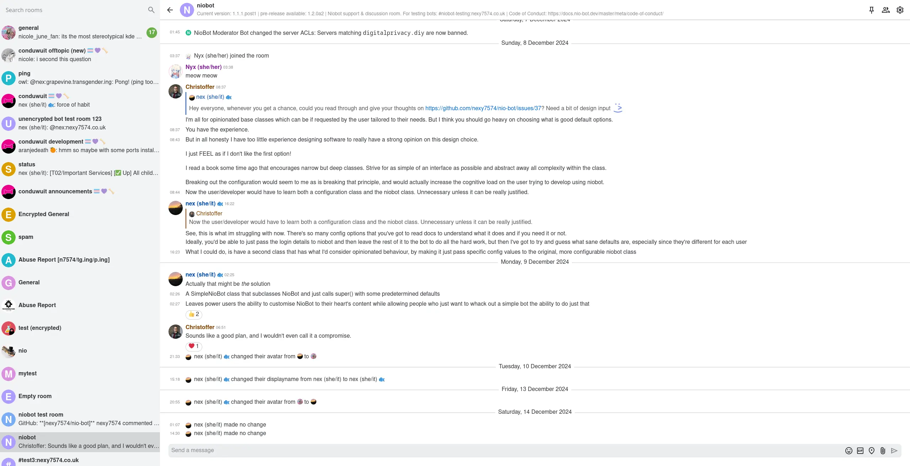
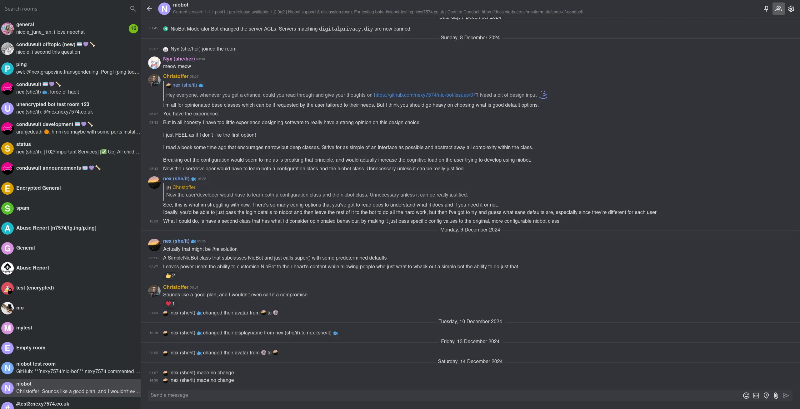
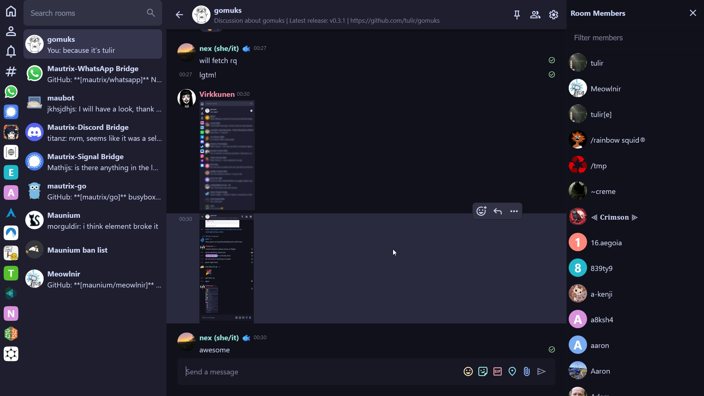

# Themes list

<!--
Template:

## Theme name

A short description of the theme.

* Tags: tag1, tag2
* Works well with: *any themes your theme is known to work well with, omit if none*
* Explicitly incompatible with: *any themes your theme is known to be incompatible with*, omit if none
* Source: [theme-name.gomuks.css](themes/theme-name.gomuks.css)
* Import: `@import url("https://nexy7574.github.io/gomuks-themes/themes/theme-name.gomuks.css");`
* Authors: [@handle of your choice](https://your-website-or-profile.example)

### Preview

-->

## Discord

A simple clone of discord's colour scheme. Allows you to have a pretty close visual experience
to discord without needing any additional scripting.

This theme is available in both light and dark variants, and will select the correct one based
on your browser's advertised preference.

* Tags: discord, light, dark
* Source: [discord.gomuks.css](themes/discord.gomuks.css)
* Import: `@import url("https://nexy7574.github.io/gomuks-themes/themes/discord.gomuks.css");`
* Authors: [@nexy7574](https://nexy7574.co.uk)

### Previews

## Catppuccin Macchiato

From catppuccin/catppuccin:

> Catppuccin is a community-driven pastel theme that aims to be the middle ground between low and high contrast themes. It consists of 4 soothing warm flavors with 26 eye-candy colors each, perfect for coding, designing, and much more! In addition, this repository tracks the development of the actual color palette, the project's documentation, organization-wide assets, resources and code samples for maintainers/developers.

* Tags: Cattpuccin, pastel, warm, dark
* Source: [catppuccin-macchiato.gomuks.css](themes/catppuccin-macchiato.gomuks.css)
* Import: `@import url("https://nexy7574.github.io/gomuks-themes/themes/catppuccin-macchiato.gomuks.css");`
* Authors: [@nexy7574](https://nexy7574.co.uk)

### Preview

## Catppuccin Mocha

From catppuccin/catppuccin:

> Catppuccin is a community-driven pastel theme that aims to be the middle ground between low and high contrast themes. It consists of 4 soothing warm flavors with 26 eye-candy colors each, perfect for coding, designing, and much more! In addition, this repository tracks the development of the actual color palette, the project's documentation, organization-wide assets, resources and code samples for maintainers/developers.

* Tags: Cattpuccin, pastel, warm, dark
* Source: [gomuksCatppuccinMocha.css](https://vrkknn.net/themes/gomuksCatppuccinMocha.css) ⚠️ External link!
* Import: `@import url("https://vrkknn.net/themes/gomuksCatppuccinMocha.css");`
* Authors: [@vrkknn:vrkknn.net](https://github.com/Virkkunen/themes/)

### Preview

