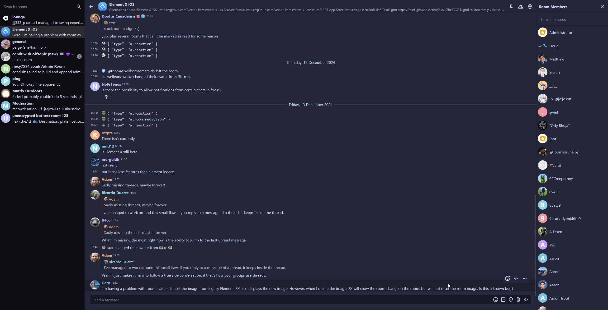

# Themes list

<!-- 
## Theme name

A short description of the theme.

* Tags: tag1, tag2
* Works well with: *any themes your theme is known to work well with*
* Explicitly incompatible with: *any themes your theme is known to be incompatible with*
* Source: [theme-name.gomuks.css](themes/theme-name.gomuks.css)
* Authors: *your github name*

### Preview

-->

## Catppuccin Macchiato

From catppuccin/catppuccin:

> Catppuccin is a community-driven pastel theme that aims to be the middle ground between low and high contrast themes. It consists of 4 soothing warm flavors with 26 eye-candy colors each, perfect for coding, designing, and much more! In addition, this repository tracks the development of the actual color palette, the project's documentation, organization-wide assets, resources and code samples for maintainers/developers.

* Tags: Cattpuccin, pastel, warm, dark
* Works well with:
* Explicitly incompatible with:
* Source: [catppuccin-macchiato.gomuks.css](themes/catppuccin-macchiato.gomuks.css)
* Authors: @nexy7574

### Preview

